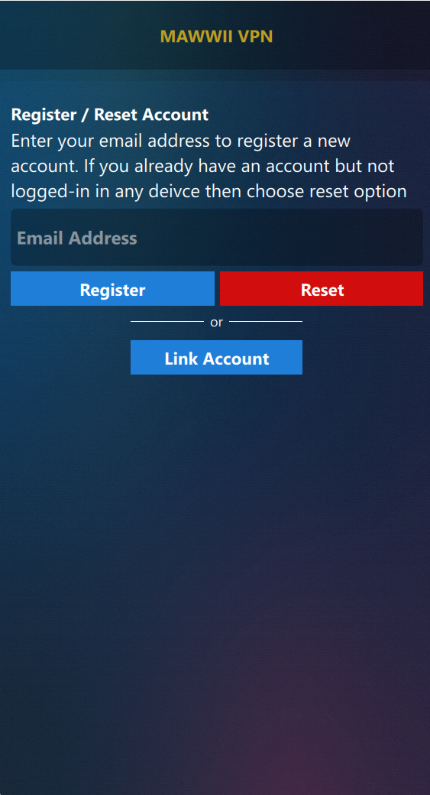
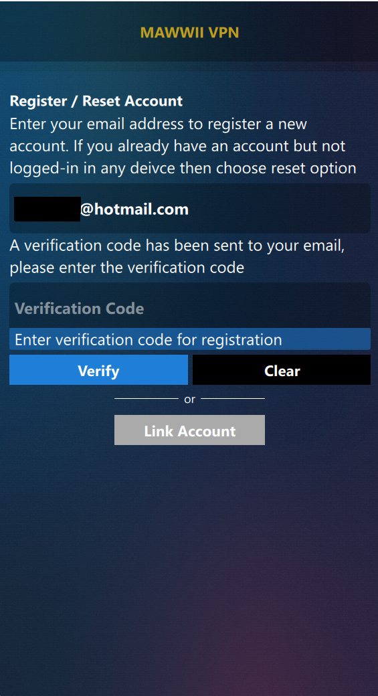
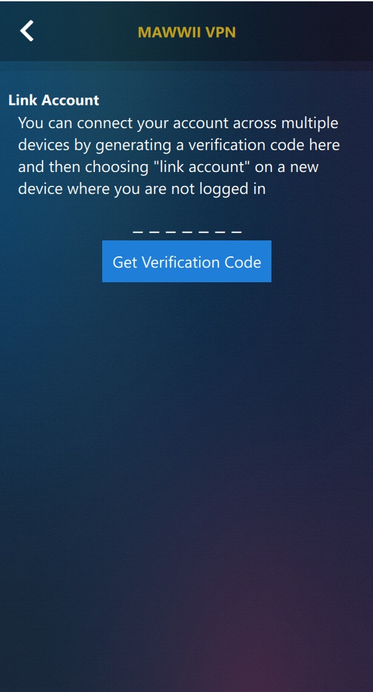
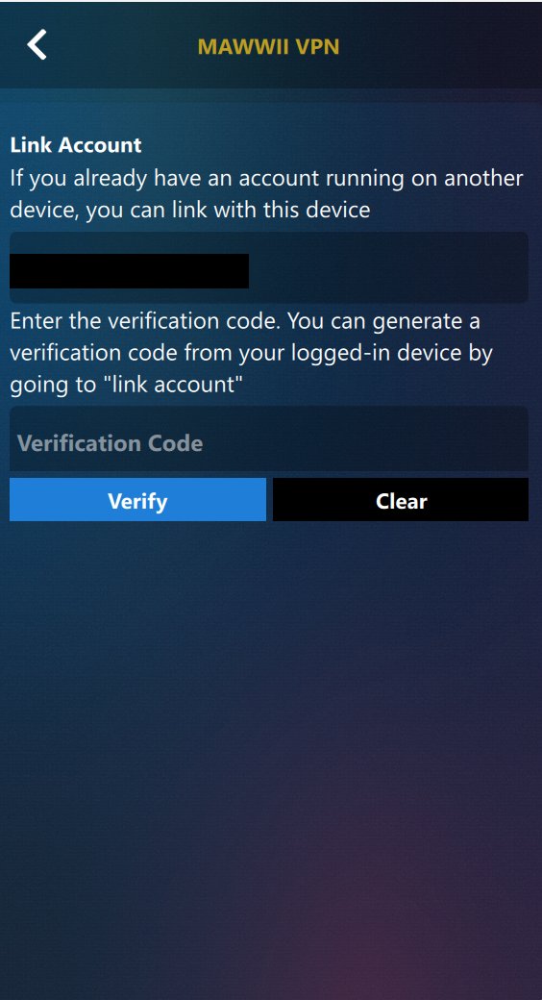
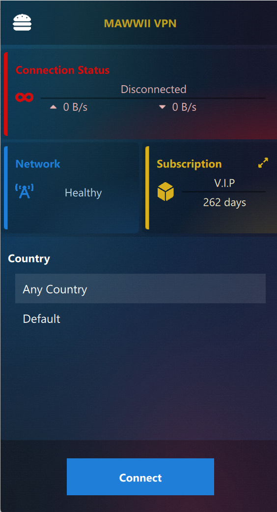
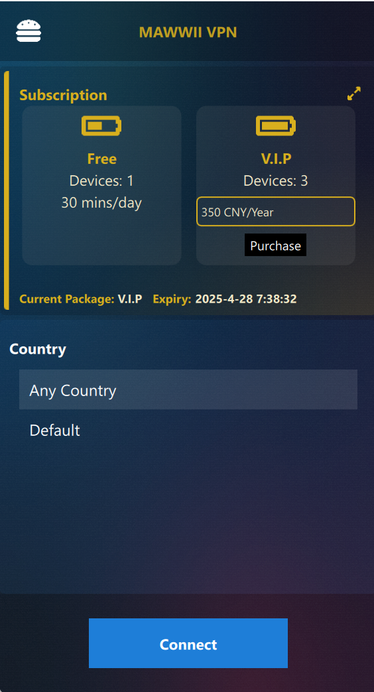
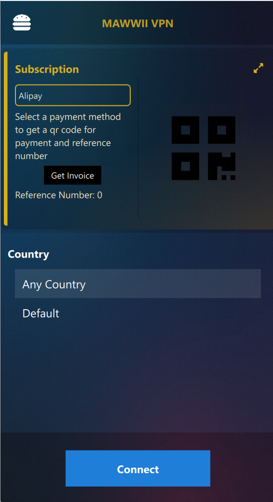
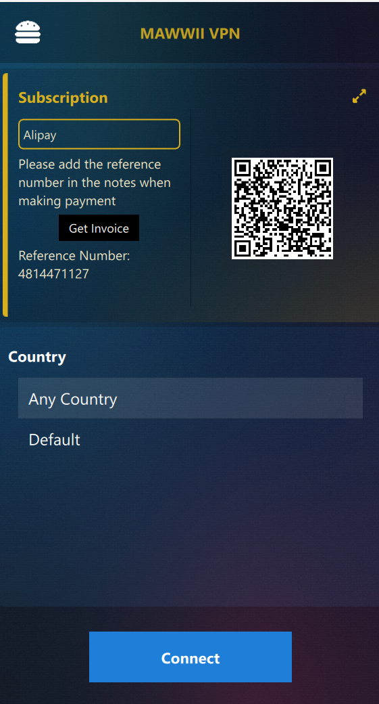

MAWWII VPN is a cross platform VPN application that is built to meet the current censorship & privacy challenges.

## Supported Platforms
You can download the latest release on our [github releases](https://github.com/mawwii/vpn/releases).
<table>
  <!-- Windows Download -->
  <tr>
    <th></th>
    <th>Platform</th>
    <th>Release</th>
    <th>Development</th>
  </tr>
  <!-- Windows -->
  <tr>
    <td>
      
    </td>
    <td>Windows</td>
    <td></td>
    <td></td>
  </tr>
  <!-- Android -->
  <tr>
    <td>
      
    </td>
    <td>Android</td>
    <td></td>
    <td></td>
  </tr>
  <!-- MacOS -->
  <tr>
    <td>
      
    </td>
    <td>MacOS</td>
    <td></td>
    <td></td>
  </tr>
  <!-- Linux -->
  <tr>
    <td>
      
    </td>
    <td>Linux</td>
    <td></td>
    <td></td>
  </tr>
  <!-- iOS -->
  <tr>
    <td>
      
    </td>
    <td>iOS</td>
    <td></td>
    <td></td>
  </tr>
</table>

## Usage Guidelines
- [Register/Reset Account](#registerreset-account)
- [Link Account](#link-account)
- [Connecting to VPN](#connecting-to-vpn)
- [Subscription Information](#subscription-information)
- [Subscribe to V.I.P Package](#subscribe-to-vip-package)

### Register/Reset Account

This is the first screen that is displayed on the fresh run of the application.

You are provided with options to: 
1. Register a New Account
2. Reset Account
3. Link Account

>Note: You will use the reset option only when you already have an account and you are not logged into your account from any of your devices.

Enter your email address in the email input box, and press register button. After which you will see the **Reset** button change to **Clear**, the **Register** button change to **Verify**, and an additional input box for **verification code**.

**Clear** will clear your inputs and reset the form back to its initial state.

**Verify** option should be used after filling in the *verification code*, the code is sent to your email address. 

**Reset Account** follows similar pattern of registration. 
>NOTE: Upon successful reset, your accounts in all other devices will stop working and they need to be linked again, and you will be logged into your account on the current device.

### Link Account
You can use a single account to login to unlimited number of devices, and thats where Link Account comes to help.

>NOTE: You need to be logged into at-least one device in order to perform this operation.

>NOTE: Your concurrent number of VPN connections is limited based on your subscription package. Free package only allows a single connection/session at a time.

<table>
  <tr>
    <td></td>
    <td></td>
  </tr>
  <tr>
    <td><i>Logged in device</i></td>
    <td><i>Logged out device</i></td>
  </tr>
</table>

From the device that you are logged in, open up the menu and choose **Link Account**. On this new screen, press **Get Verification Code**, wait for a moment until you see the code.

From your new device, where you are not logged in yet, press on **Link Account** button, this will take you to *Link Account* screen for a new device. Enter your email address in the input box, after which you should be able to see the *verification code* input box. Enter the code that you got from your other device (logged-in device) in this box, and then press on **Verify** button.

At this point you should be logged into your account on the new device.

### Connecting to VPN
<table>
  <tr><td></td></tr>
  <tr><td><i>Home Screen</i></td></tr>
</table>

In the *Home* screen you will find an overview of your connection and subscription. This is also where you can connect to VPN, choose the country from the list and press on **Connect** button. 
>NOTE: On Android and MacOS platforms, you will be prompted to allow certain permissions for the application. You must approve of such permissions in order for the VPN to work.

### Subscription Information
<table>
  <tr>
    <td></td>
    <td></td>
  </tr>
  <tr>
    <td><i>Subscription Minimal View</i></td>
    <td><i>Subscription Expanded View</i></td>
  </tr>
</table>

In the subscription box on the right side of your screen, you can see the name of the package you are currently subscribed with and its expiry days or minutes. On pressing the *expansion arrows* on top right corner of this box, you will expand the subscription box and from here you see a more exact time for your package expiry, also this is where you can subscribe to a different package as well.
>NOTE: Free package gives limited minutes of VPN session within 24 hours, since the start of your VPN session. This usage limit will reset after 24 hours. 

>NOTE: You might still see **0 mins** on your free package even after 24 hours have passed, but this will refresh when you make a new VPN connection attempt.

### Subscribe to V.I.P Package
<table>
  <tr>
    <td></td>
    <td></td>
    <td></td>
  </tr>
  <tr>
    <td><i>Subscription Expanded View</i></td>
    <td><i>Subscription Purchase View</i></td>
    <td><i>Purchase QR Code</i></td>
  </tr>
</table>

TODO: